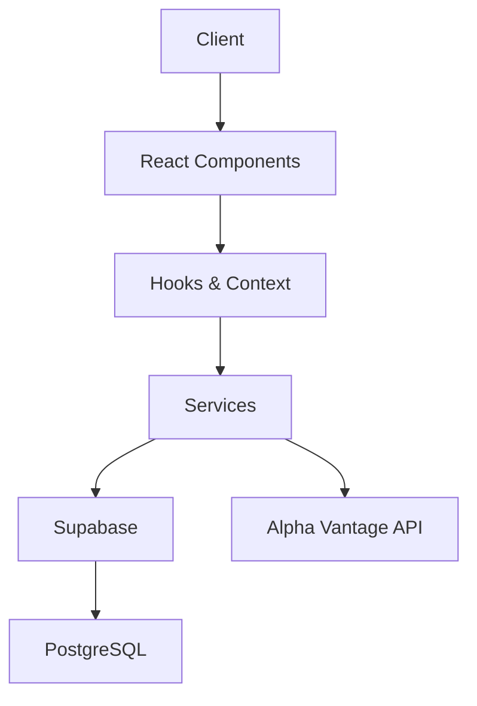
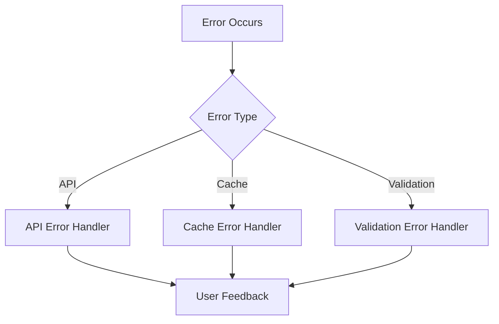
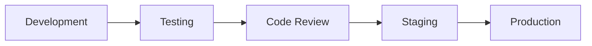

# Architecture Overview

## System Architecture

Virgin Fund follows a modern, component-based architecture with clear separation of concerns and robust error handling.

## Key Components

### Frontend Layer

1. **UI Components**
   - Glass-morphic design system
   - Reusable components
   - Error boundaries
   - Loading states

2. **State Management**
   - Zustand for global state
   - React Query for server state
   - Context for component state

3. **Routing**
   - React Router
   - Protected routes
   - Navigation guards

### Service Layer

1. **Search Service**
   - Multi-level caching
   - Error handling
   - Rate limiting
   - Retry mechanism

2. **Authentication Service**
   - Supabase Auth
   - Session management
   - Protected routes

3. **Database Service**
   - Supabase client
   - Type-safe queries
   - Migration management

### Data Layer

1. **Caching System**
   - Browser cache
   - Database cache
   - Cache invalidation

2. **Database Schema**
   - User profiles
   - Search history
   - Investment strategies
   - Transactions

## Error Handling

### Error Types

1. **API Errors**
   - Rate limiting
   - Network issues
   - Invalid responses

2. **Cache Errors**
   - Storage limits
   - Corruption
   - Invalidation

3. **Validation Errors**
   - Input validation
   - Type checking
   - Business rules

## Security

1. **Authentication**
   - Email/password
   - Session management
   - Token handling

2. **Authorization**
   - Row Level Security
   - Policy enforcement
   - Role-based access

3. **Data Protection**
   - Input sanitization
   - Output encoding
   - CORS policies

## Performance

1. **Caching Strategy**
   - Browser cache
   - Database cache
   - Cache invalidation
   - Cache warming

2. **Optimization**
   - Code splitting
   - Lazy loading
   - Asset optimization
   - Query optimization

3. **Monitoring**
   - Performance metrics
   - Error tracking
   - Usage analytics

## Development Workflow

1. **Development**
   - Feature branches
   - TypeScript
   - Linting
   - Testing

2. **Testing**
   - Unit tests
   - Integration tests
   - E2E tests
   - Performance tests

3. **Deployment**
   - CI/CD pipeline
   - Environment management
   - Version control
   - Rollback procedures