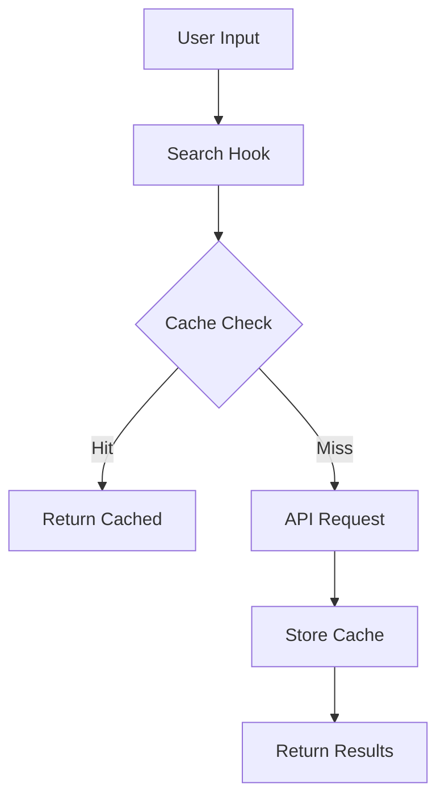

# Search System Documentation

## Overview

The search system provides a robust and efficient way to search financial instruments with multi-level caching and comprehensive error handling.

## Components

1. [Search Service](./search-service.md)
2. [Error Handling](./error-handling.md)
3. [Caching Strategy](./caching.md)
4. [Rate Limiting](./rate-limiting.md)

## Architecture



## Features

- Multi-level caching
- Graceful degradation
- Rate limit handling
- Error recovery
- Performance metrics
- Debug mode

## Usage

```typescript
import { useSearch } from '@/lib/hooks/useSearch';

function SearchComponent() {
  const { results, loading, error, search } = useSearch();

  // Handle search
  const handleSearch = async (query: string) => {
    await search(query);
  };
}
```

## Error Handling

The search system uses a comprehensive error handling approach:

```typescript
try {
  await search(query);
} catch (error) {
  if (error instanceof SearchError) {
    // Handle specific error types
    switch (error.details.code) {
      case 'RATE_LIMIT':
        // Handle rate limiting
        break;
      case 'API_ERROR':
        // Handle API errors
        break;
      // ...
    }
  }
}
```

## Caching Strategy

1. **Browser Cache**
   - Duration: 24 hours
   - Storage: localStorage
   - Key format: `financial_data_${userId}_${symbol}`

2. **Database Cache**
   - Table: search_history
   - Includes: results, timestamp, search count
   - Automatic cleanup

## Rate Limiting

- 5 requests per minute
- Automatic retry with backoff
- Cache fallback
- User feedback

## Metrics

The search system tracks various metrics:

```typescript
interface SearchMetrics {
  cacheHits: number;
  apiCalls: number;
  averageResponseTime: number;
  retryCount: number;
  rateLimitRemaining: number;
}
```

## Database Schema

```sql
CREATE TABLE search_history (
  id uuid PRIMARY KEY,
  user_id uuid REFERENCES auth.users(id),
  symbol text NOT NULL,
  results jsonb NOT NULL,
  search_count integer DEFAULT 1,
  last_searched timestamptz DEFAULT now()
);
```

## Best Practices

1. **Error Handling**
   - Always use SearchError class
   - Provide user-friendly messages
   - Include technical details
   - Log errors appropriately

2. **Caching**
   - Validate cache freshness
   - Handle cache misses gracefully
   - Implement proper invalidation
   - Monitor cache hit ratio

3. **Performance**
   - Monitor response times
   - Track API usage
   - Optimize cache usage
   - Handle rate limits

4. **User Experience**
   - Show loading states
   - Provide error feedback
   - Display cache status
   - Implement retry mechanisms